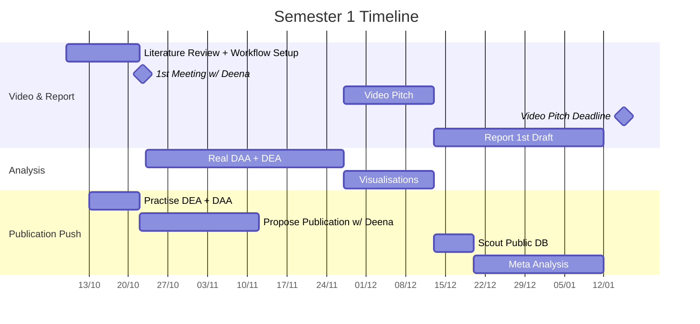
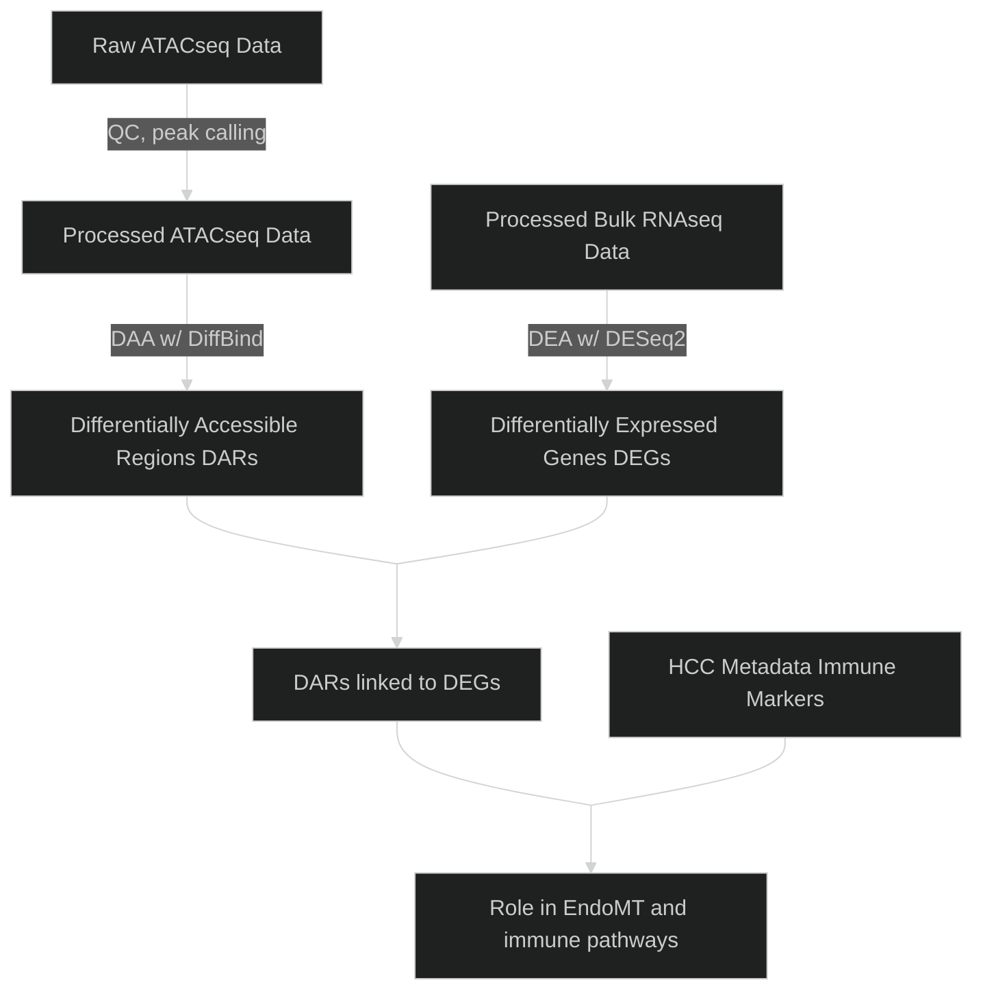

# 🧬 Epigenetic regulation of liver endothelial cells (LSECs) as a novel target to boost immunotherapy efficacy in hepatocellular cancer (HCC)

This project focuses on **EHMT2**, an epigenetic regulator, and its links with immune pathways and the *endothelial-to-mesenchymal transition* in *liver sinusoidal epithelial cells* (LSECs) which aid in the development of *hepatocellular cancer* (HCC).

## 📋 Plan Overview


## 🎯 Objectives



1) Analyse RNA-seq data from LSECs samples with and without EHMT2 knockdown to identify differentially expressed genes (DEGs).

2) Analyse ATAC-seq data from LSECs samples with and without EHMT2 knockdown to identify differentially accessible regions (DERs).

3) Compare DEGs against DERs to validate downstream effects of EHMT2 knockdown.

4) Study DEGs and DERs to find associations with immune markers.

## 📁 Files & Directories

```bash
bioinformatics-project/
├── ATAC-Seq/                     # ATAC-Seq scriptsand results
├── RNA-Seq/                      # RNA-Seq scriptsand results
├── Integrated_Multiomics/        # Combining ATAC-Seq and RNA-Seq
├── HCC_scRNA/                    # HCC scRNA analysis
├── EnviromentBuilding/           # Including references building
├── Documents/                    # Report draft, slides and meeting records
└── README.md
└── .gitignore                # list of files to not track
```
## ⚠️ Notice
Cause of limitation of file size in GitHub, files listed below are not included in repo.

- .fastq.gz (Raw Data)
- .RData (Image of analysis)
- .RDS Larger than 100 MB
- .bedGraph (MACS2 visualizaion data of ATAC-Seq)
- .fasta, .gtf, .gff3 (Genome references files)


## 👥 Contributors

- Zhaoshuo Liu
- Miguel Alburo
- Simran Panda
- Yash Dhiman

