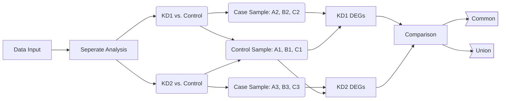
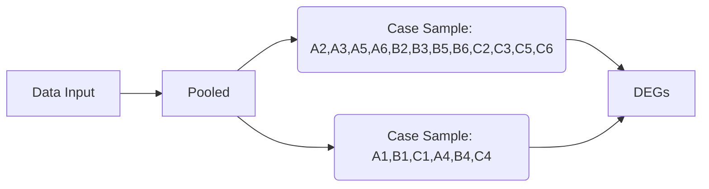

# RNA-Seq Differential Expression Analysis (DEGs)


## Sample ID
| | **No TGFb2 treatment** | **With TGFb2 treatment** |
|---|---|---|
| **Control** | A1, B1, C1 | A4, B4, C4 |
| ***EHMT2*_KD1** | A2, B2, C2 | A5, B5, C5 |
| ***EHMT2*_KD2** | A3, B3, C3 | A6, B6, C6 |


## Analysis Description
This repository contains two parallel versions of the RNA-Seq DEGs analysis, each employing a different sample selection and grouping strategy:

*   **Version 1 (Liu's Analysis): Baseline Knockdown Effects**
    *   **Sample Selection:** Excludes all TGFb2-treated samples to strictly evaluate the baseline effects of *EHMT2* knockdown.
    *   **Methodology:** Conducted as **two separate** DEG analyses to assess the independent impact of each knockdown strain:
        1.  *EHMT2*_KD1 vs. Control
        2.  *EHMT2*_KD2 vs. Control

*   **Version 2 (Miguel's Analysis): Pooled Environmental Effects**
    *   **Sample Selection:** Includes both untreated and TGFb2-treated samples.
    *   **Methodology:** Conducted as a **single, pooled** DEG analysis to observe broader trends across different conditions:
        *   *Control Group:* All Control samples (inclusive of both untreated and TGFb2-treated).
        *   *Experimental Group:* All knockdown samples pooled together (inclusive of KD1 and KD2, both untreated and TGFb2-treated).


## Workflow of Two Version
*   **Version 1 (Liu's Analysis): Baseline Knockdown Effects**


*   **Version 2 (Miguel's Analysis): Pooled Environmental Effects**


  
## Rationale for Further Multi-Omics Downstream Analysis Pipeline Selection

This repository archives two methodological approaches for the RNA-Seq Differential Expression Analysis (DEGs), each serving a distinct scientific objective.

**1. Adopted Pipeline for Current Report (Liu's Version): Baseline Knockdown Effects**
For the current multi-omics integration (ATAC-Seq & RNA-Seq) and downstream functional enrichment, **Version 1** has been adopted as the primary dataset. 
*   **Scientific Justification:** 
    *   *Confounding Variable Control:* The primary objective of the current report is to investigate the intrinsic, baseline mechanism of *EHMT2* in LSECs. Including TGFb2-treated samples introduces massive transcriptional background noise, as TGFb2 is a potent inducer of EndoMT. Excluding these allows us to isolate the pure epigenetic effects of *EHMT2* knockdown.
    *   *Sequence-Specific Evaluation:* KD1 and KD2 utilize different targeting sequences. Analyzing them separately ensures we can cross-validate the DEGs and filter out sequence-specific off-target effects.

**2. Future Directions & Analytical Foundation (Miguel's Version): Environmental Interactions**
**Version 2**, which utilizes a pooled analytical approach including both untreated and TGFb2-treated samples, has been fully archived to serve as a robust foundation for future research.
*   **Scientific Potential:** 
    *   While outside the scope of the current baseline mechanism report, this pooled analysis provides a crucial preliminary framework for exploring the complex interactions between the TGFb2 signaling pathway (a known driver of EndoMT in the HCC microenvironment) and *EHMT2* epigenetic regulation. This version will be highly valuable for subsequent investigations into how external cytokines influence LSEC plasticity in conjunction with epigenetic modifications.


## Directories

```bash
RNA-Seq/
├── DOWNSTREAM_ANALYSIS/     # DGEs (Liu's Version)
├── result_Miguel/           # DGEs (Miguel's Version)
└── results/                 # RNA-Seq Quantitive Result from Salmon

```
